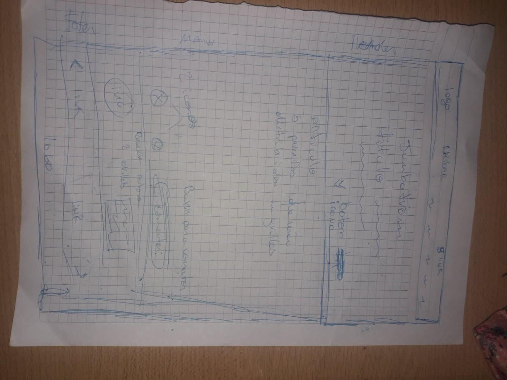
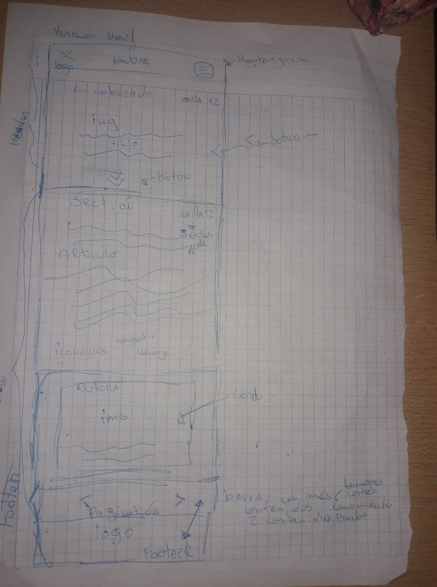

# Maqueta sitio web

## pre-maquetado Sketch escritorio

se crea una maqueta comenzando por un navbar
que contenga logo y los siguientes 5 links 

- nosotros
- trabajos
- blog
- horas
- contacto

la pag contendrá:

- encabezado,compuesto de un jumbotrom con titulo y botón 
- articulo referente a la pag con 5 parrafos distribuidos en grillas con  2 iconos al final(me encanta,compartir) y barra de comentario.
- pequeña reseña de autora con foto y datos.
- ademas contiene un footer dividido en dos la primera tendrá la opción para pasar o retroceder de pag para terminar en la segunda con el logo de la empresa.

## pre-maquetado Sketch movil

Su navbar mantendrá logo y tendrá una hamburguesa con las mismas opciones de la versión escritorio.

la versión móvil va a contener el articulo con opción de esconderlo.

el footer se mantendrá igual

## maquetación

- se crea archivo index.html y se comienza a dar estructura junto a bootstrap se agrega priopiedades de otras paginas como font awesome,google fonts y nuestra pag de estilo propio.

	<!doctype html>
	<html lang="en">
	<head>
    <!-- Required meta tags -->
    <meta charset="utf-8">
    <meta name="viewport" content="width=device-width, initial-scale=1, shrink-to-fit=no">

    <!-- Bootstrap CSS -->
    <link rel="stylesheet" href="https://stackpath.bootstrapcdn.com/bootstrap/4.1.1/css/bootstrap.min.css" integrity="sha384-WskhaSGFgHYWDcbwN70/dfYBj47jz9qbsMId/iRN3ewGhXQFZCSftd1LZCfmhktB" crossorigin="anonymous">
    <!--google fonts-->

    <!--Main Styles-->
    <link rel="stylesheet" href="">
    <title>Hello, world!</title>
	</head>
	<body>
	<h1>Hello, world!</h1>

    

    <!-- Optional JavaScript -->
    <!-- jQuery first, then Popper.js, then Bootstrap JS -->
    
    
    
      <!--Font Awesome-->
		<link rel="stylesheet" href="https://use.fontawesome.com/releases/v5.0.13/css/all.css" integrity="sha384-DNOHZ68U8hZfKXOrtjWvjxusGo9WQnrNx2sqG0tfsghAvtVlRW3tvkXWZh58N9jp" crossorigin="anonymous">
	</body>
	</html>

- se agrega barra navbar de bootstrap y jumbotrom para conformar nuestro header.
- se comienza a dar estilo propio con nuestro archivo estilos.css.

 https://emedebler.github.io/maquetaci-n-02/
